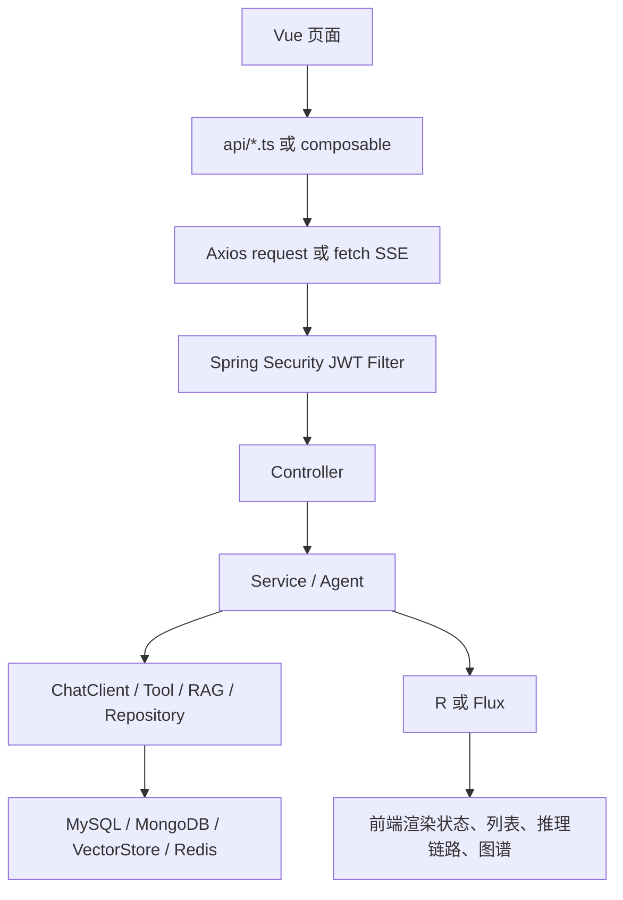
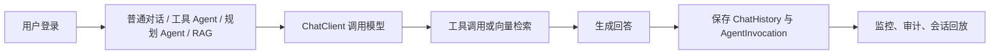
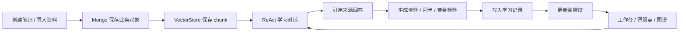

# MyAgent 项目模块功能执行实现流程

生成日期：2026-06-03

本文档基于当前代码实现梳理项目各模块的功能边界、接口入口、核心服务调用链、数据落库与前端触发流程。内容描述以当前代码为准，不以历史规划文档为准。

---

## 1. 项目整体执行链路

### 1.1 技术栈分层

| 层级 | 当前实现 |
|---|---|
| 前端 | Vue 3、Vite、Element Plus、Pinia、Vue Router、Axios、Fetch ReadableStream |
| 后端框架 | Spring Boot 3.3.5、Spring MVC、Spring Security、Spring Data JPA、Spring Data MongoDB |
| AI 能力 | Spring AI ChatClient、OpenAI 兼容模型、工具调用、ChatMemory、QuestionAnswerAdvisor |
| 模型配置 | DeepSeek 主模型、Qwen 兜底模型 |
| 存储 | MySQL、MongoDB、Redis 可选记忆仓库、Qdrant/VectorStore |
| 文档解析 | TextReader、PagePdfDocumentReader、Apache POI XWPF |
| 统一能力 | JWT、RBAC、TraceId、统一响应体 `R<T>`、全局异常处理、SSE 流式事件 |

### 1.2 典型请求执行流程



### 1.3 后端启动扫描流程

入口类：`com.chat.myAgent.main.MainApplication`

启动时执行：

1. `@SpringBootApplication(scanBasePackages = "com.chat.myAgent")` 扫描组件、配置、Controller、Service、Agent、Tool。
2. `@EnableJpaRepositories` 扫描：
   - `com.chat.myAgent.repository`
   - `com.chat.myAgent.learn.repository.jpa`
3. `@EnableMongoRepositories` 扫描：
   - `com.chat.myAgent.repository.mongo`
   - `com.chat.myAgent.learn.repository.mongo`
4. `@EntityScan` 扫描：
   - `com.chat.myAgent.model.entity`
   - `com.chat.myAgent.learn.model`
5. `@EnableScheduling` 打开调度能力。

这意味着：

| 数据类型 | 扫描位置 | 代表对象 |
|---|---|---|
| JPA Entity | `model.entity`、`learn.model` | `UserEntity`、`ChatHistoryEntity`、`StudyRecordEntity` |
| JPA Repository | `repository`、`learn.repository.jpa` | `UserRepository`、`StudyRecordRepository` |
| Mongo Document | `model.mongo`、`learn.model` | `ChatMessageDocument`、`KnowledgeNoteDocument`、`FlashcardDocument` |
| Mongo Repository | `repository.mongo`、`learn.repository.mongo` | `MongoChatSessionRepository`、`KnowledgeNoteRepository`、`FlashcardRepository` |

---

## 2. 通用基础模块

### 2.1 统一响应体

核心类：`R<T>`

所有普通 HTTP 接口统一返回：

```json
{
  "code": 200,
  "message": "success",
  "data": {},
  "timestamp": "2026-06-03T10:00:00"
}
```

执行流程：

1. Controller 调用 `R.ok(data)`、`R.ok(message, data)`、`R.fail(...)`。
2. 前端 `request.ts` 在响应拦截器中判断是否存在 `code` 字段。
3. `code === 200` 时直接返回 `data`。
4. 非 200 时弹出 `ElMessage.error` 并 reject。

### 2.2 全局异常处理

核心类：`GlobalExceptionHandler`

处理流程：

1. Controller 或 Service 抛出异常。
2. `@RestControllerAdvice` 捕获异常。
3. 按异常类型转换为统一响应：
   - `BizException` -> 业务错误码。
   - `NonTransientAiException` -> 模型服务异常。
   - `MethodArgumentNotValidException` -> 参数校验失败。
   - `ConstraintViolationException` -> 约束校验失败。
   - `AccessDeniedException` -> 权限不足。
   - 其他异常 -> dev 环境返回原始 message，非 dev 返回通用错误。

### 2.3 TraceId 链路

核心类：

| 类 | 职责 |
|---|---|
| `TraceContextFilter` | 请求进入时生成或读取 `X-Trace-Id` |
| `TraceContext` | ThreadLocal 保存 traceId |
| `TraceContextMdcFilter` | 将 traceId 写入 MDC，供日志输出 |
| `AuditService` | Agent 调用记录保存 traceId |

执行流程：

1. HTTP 请求进入。
2. `TraceContextFilter` 读取请求头 `X-Trace-Id`。
3. 如果请求没有 traceId，则生成新的 traceId。
4. traceId 写入响应头。
5. `TraceContextMdcFilter` 将 traceId 写入日志 MDC。
6. Agent 调用、审计、异常日志都可以关联同一个 traceId。

---

## 3. 认证与权限模块

### 3.1 注册流程

接口：`POST /api/v1/auth/register`

执行链路：

1. `AuthController.register()` 接收 `RegisterRequest`。
2. 使用 `UserRepository.existsByUsername()` 校验用户名是否存在。
3. 使用 `BCryptPasswordEncoder` 加密密码。
4. 创建 `UserEntity`：
   - `role = USER`
   - `enabled = true`
   - `nickname` 默认等于用户名。
5. 保存到 MySQL。
6. `JwtTokenProvider.generateToken(username, role)` 生成 JWT。
7. 返回 `AuthResponse`。

### 3.2 登录流程

接口：`POST /api/v1/auth/login`

执行链路：

1. `AuthController.login()` 根据用户名查找 `UserEntity`。
2. 使用 `passwordEncoder.matches()` 校验密码。
3. 检查 `enabled` 状态。
4. 更新 `lastLoginAt`。
5. 生成 JWT。
6. 返回 token、username、role、nickname、expiresIn。

### 3.3 JWT 鉴权流程

核心类：`JwtAuthenticationFilter`

执行链路：

1. 从请求头读取 `Authorization: Bearer {token}`。
2. `JwtTokenProvider.validateToken()` 校验签名、格式、过期时间。
3. 从 token 中解析 `username` 与 `role`。
4. 使用 `UserRepository.findByUsername()` 确认用户仍存在且未禁用。
5. 构造 `UsernamePasswordAuthenticationToken`。
6. 设置到 `SecurityContextHolder`。
7. 后续 Controller、Service 可通过 SecurityContext 获取当前用户。

### 3.4 权限路由规则

核心类：`SecurityConfig`

当前主要规则：

| 路径 | 权限 |
|---|---|
| `/api/v1/auth/**` | 公开 |
| `/api/v1/chat/**` | 公开 |
| `/api/v1/agent/**` | 公开 |
| `/api/v1/planning/**` | 公开 |
| `/api/v1/stream/**` | 公开 |
| `/api/v1/learn/**` | 登录用户 |
| `/api/v1/knowledge/stream` | 公开 |
| `/api/v1/knowledge/ask/**` | 登录用户 |
| `/api/v1/knowledge/search` | 登录用户 |
| `/api/v1/knowledge/status` | 登录用户 |
| `POST /api/v1/knowledge/upload` | ADMIN |
| `POST /api/v1/knowledge/load-directory` | ADMIN |
| `/api/v1/knowledge/documents/**` | USER 或 ADMIN |
| `/api/v1/admin/**` | ADMIN |
| `/api/v1/monitor/**` | ADMIN |
| `/api/v1/audit/**` | ADMIN |
| `/api/v1/ops/**` | ADMIN |
| `/api/v1/performance/**` | ADMIN |
| `/api/v1/session/**` | 登录用户 |
| `/api/v1/permission/**` | 登录用户 |

### 3.5 前端权限流程

核心文件：

| 文件 | 职责 |
|---|---|
| `front/src/router/index.ts` | 路由守卫 |
| `front/src/store/modules/user.ts` | token 与用户信息 |
| `front/src/store/modules/permission.ts` | 菜单权限 |
| `front/src/api/permission.ts` | 请求当前用户权限 |

执行流程：

1. 用户访问页面。
2. 路由守卫检查 `meta.requiresAuth`。
3. 如果无 token，跳转 `/login`。
4. 如果有 token 且权限未加载，请求 `/api/v1/permission/current`。
5. 根据后端返回的 `menus` 判断当前路由是否可访问。
6. 无权限时提示并跳转 `/home`。

---

## 4. 模型、记忆与 ChatClient 配置模块

### 4.1 模型配置

核心类：`ModelConfig`

功能：

1. 读取 `smart-agent.models` 配置。
2. 维护默认主模型与兜底模型。
3. 提供 `getPrimaryModel()` 与 `getFallbackModelName()`。

### 4.2 ChatClient 配置

核心类：`ChatClientConfig`

当前提供的 Bean：

| Bean | 用途 |
|---|---|
| `primaryOpenAiApi` | DeepSeek OpenAI 兼容 API |
| `fallbackOpenAiApi` | Qwen OpenAI 兼容 API |
| `primaryChatModel` | 主模型 |
| `fallbackChatModel` | 兜底模型 |
| `baseChatClient` | 普通无记忆 ChatClient |
| `fallbackChatClient` | 兜底 ChatClient |
| `memoryChatClient` | 带 ChatMemory 的对话客户端 |
| `toolChatClient` | 带工具提示词和记忆的工具客户端 |
| `ragChatClient` | 带记忆与 QuestionAnswerAdvisor 的 RAG 客户端 |
| `fullAgentClient` | 带记忆的全能力 Agent 客户端 |

### 4.3 记忆配置

核心类：`MemoryConfig`

执行流程：

1. Spring 尝试从容器中获取 `RedisChatMemoryRepository`。
2. 如果 Redis 记忆仓库存在，则构建 Redis 版 `MessageWindowChatMemory`。
3. 如果不存在，则使用 `InMemoryChatMemoryRepository`。
4. 最大消息窗口为 50 条。

---

## 5. 普通聊天模块

### 5.1 记忆对话

接口：`POST /api/v1/chat/memory`

执行链路：

1. `ChatController.memoryChat()` 接收 `ChatRequest`。
2. 调用 `ChatAgent.chat(request)`。
3. `ChatAgent` 解析或生成 `conversationId`。
4. 使用 `memoryChatClient`：
   - 设置系统提示词。
   - 传入用户消息。
   - 通过 `ChatMemory.CONVERSATION_ID` 绑定会话。
5. 主模型返回内容。
6. 查询当前会话历史长度。
7. `AuditService.saveChatHistory()` 保存用户消息和助手消息。
8. `AuditService.saveAgentInvocation()` 保存一次 Agent 调用记录。
9. 返回 `ChatResponse`。
10. 如果主模型失败，调用 `fallbackChatClient` 生成兜底回答。

### 5.2 记忆流式对话

接口：`GET /api/v1/chat/memory/stream`

执行链路：

1. `ChatController.memoryChatStream()` 创建 `ChatRequest`。
2. `ChatAgent.memoryChatStream()` 使用 `memoryChatClient.stream().content()`。
3. 返回 `Flux<String>`。
4. 事件顺序：
   - `start`
   - 多个 `delta`
   - `done`
5. `doFinally` 中保存聊天历史与 Agent 调用记录。

---

## 6. 工具调用 Agent 模块

### 6.1 工具集合

当前旧 Agent 工具包括：

| 工具类 | 能力 |
|---|---|
| `DateTimeTool` | 时间、日期、日期差计算 |
| `CalculatorTool` | 数学表达式、百分比、单位换算 |
| `TranslateTool` | 翻译、语言检测 |
| `DocParseTool` | 读取本地 docs 文件 |
| `DbQueryTool` | 查询内置员工/部门示例数据 |

### 6.2 无记忆工具对话

接口：`POST /api/v1/agent/chat`

执行链路：

1. `AgentController.chat()` 接收 `AgentRequest`。
2. 调用 `ToolAgent.chat()`。
3. 注册全部工具到 `baseChatClient.prompt().tools(...)`。
4. 模型自行决定是否调用工具。
5. 工具执行结果返回给模型。
6. 模型整合工具结果生成最终回答。
7. 保存 Agent 调用审计。
8. 返回 `AgentResponse`。

### 6.3 带记忆工具对话

接口：`POST /api/v1/agent/chat/memory`

执行链路：

1. 与无记忆工具对话类似。
2. 额外通过 `ChatMemory.CONVERSATION_ID` 绑定会话。
3. 后续问题可利用同一 conversationId 下的历史上下文。

### 6.4 指定工具对话

接口：`POST /api/v1/agent/chat/specific`

执行链路：

1. 前端或调用方在请求中传入 `tools` 列表。
2. `ToolAgent.selectTools()` 根据名称筛选工具。
3. 只把选中的工具注册给 ChatClient。
4. 模型只能在指定工具范围内选择调用。

---

## 7. 全能力、流式、规划与结构化 Agent 模块

### 7.1 FullAgent

主要接口：

| 接口 | 入口 |
|---|---|
| 同步全能力对话 | `PlanningController.fullChat()` |
| 流式全能力对话 | `FullAgent.chatStream()` 由相关流式入口调用 |

执行链路：

1. 解析或生成 `conversationId`。
2. 获取当前登录用户名，未登录则为 `anonymous`。
3. 使用 `fullAgentClient`。
4. 注册日期、计算器、翻译、文档解析、数据库查询工具。
5. 绑定 ChatMemory conversationId。
6. 生成回答。
7. 保存聊天历史与 Agent 调用审计。

### 7.2 StreamAgent

接口：

| 接口 | 功能 |
|---|---|
| `GET /api/v1/stream/chat` | 基础流式对话 |
| `GET /api/v1/stream/chat/tools` | 带工具的流式对话 |

执行链路：

1. `StreamController` 接收 message 和 conversationId。
2. `StreamAgent.streamChat()` 或 `streamChatWithTools()` 构建流式 ChatClient 调用。
3. 通过 `Flux.concat()` 输出：
   - `start`
   - 多个 `delta`
   - `done`
4. `StringBuilder` 累积完整回答。
5. `doFinally` 保存用户消息、助手消息和 Agent 调用记录。

### 7.3 PlanningAgent

接口：

| 接口 | 功能 |
|---|---|
| `POST /api/v1/planning/execute` | 规划并可自动执行 |
| `POST /api/v1/planning/plan-only` | 只生成规划 |
| `GET /api/v1/planning/stream` | 流式返回规划步骤 |
| `POST /api/v1/planning/chat` | FullAgent 对话 |

规划执行链路：

1. `PlanningController.planAndExecute()` 接收 `PlanningRequest`。
2. `PlanningAgent.planAndExecute()` 使用 `planning-system.st` 提示词请求模型生成 JSON。
3. 清理模型返回中的 Markdown 代码块。
4. 使用 `ObjectMapper` 解析 JSON。
5. 如果 `needPlanning=false`：
   - 直接返回 `directAnswer`。
   - 保存 `planning-direct` 审计。
6. 如果 `autoExecute=false`：
   - 将 steps 转为 `StepResult`，状态为未执行。
   - 保存 `planning-only` 审计。
7. 如果 `autoExecute=true`：
   - 遍历 steps。
   - 根据 `toolNeeded` 选择工具。
   - 每一步执行结果追加到上下文累积器。
   - 最后调用模型生成完整最终回答。
   - 保存 `planning-execute` 审计。
8. 如果规划 JSON 解析失败，回退到 FullAgent 直接执行。

### 7.4 StructuredAgent

当前能力：

| 方法 | 输出对象 |
|---|---|
| `extractBookInfo()` | `BookInfo` |
| `analyzeTask()` | `TaskAnalysis` |
| `analyzeSentiment()` | `SentimentResult` |

执行链路：

1. 使用特定系统提示词或内置提示。
2. 调用 `baseChatClient.prompt().call().entity(Class)`。
3. Spring AI 按目标类型生成结构化 JSON 并反序列化为 Java 对象。

---

## 8. RAG 知识库模块

### 8.1 文档上传入库

接口：`POST /api/v1/knowledge/upload`

执行链路：

1. `KnowledgeController.uploadDocument()` 接收 `MultipartFile`。
2. 校验文件非空。
3. 调用 `DocumentService.uploadAndIndex(file)`。
4. `DocumentService` 规范化文件名。
5. 校验扩展名，目前支持：
   - `.txt`
   - `.md`
   - `.pdf`
   - `.docx`
6. 根据文件类型解析：
   - txt/md -> `TextReader`
   - pdf -> `PagePdfDocumentReader`
   - docx -> `XWPFDocument + XWPFWordExtractor`
7. 使用 `TokenTextSplitter` 切片。
8. 为每个 chunk 写入 metadata：
   - `userId`
   - `docId`
   - `sourceType`
   - `sourceName`
   - `title`
   - `category`
   - `tags`
   - `chunkId`
   - `chunkIndex`
   - `totalChunks`
   - `enabled`
9. 调用 `vectorStore.add(chunks)` 入库。
10. 如果当前 VectorStore 是 `SimpleVectorStore`，则保存到本地文件。
11. 将文档元信息写入内存 `documentRegistry`。
12. Controller 返回 `DocumentVO`。

### 8.2 批量加载目录

接口：`POST /api/v1/knowledge/load-directory`

执行链路：

1. Controller 接收目录路径。
2. `DocumentService.indexKnowledgeDirectory(dirPath)` 检查目录是否存在。
3. 枚举支持格式文件。
4. 跳过 `documentRegistry` 中已存在的文件。
5. 对每个文件执行 `indexLocalFile()`。
6. 返回每个文档的 `DocumentVO`。

### 8.3 文档列表与删除

接口：

| 接口 | 功能 |
|---|---|
| `GET /api/v1/knowledge/documents` | 列出内存 registry 中的文档 |
| `DELETE /api/v1/knowledge/documents/{fileName}` | 删除文档向量 |

删除流程：

1. 校验 fileName 字符合法。
2. `DocumentService.deleteDocument(fileName)` 查询 `documentRegistry`。
3. 获取 `documentIds`。
4. 调用 `vectorStore.delete(documentIds)`。
5. 从 `documentRegistry` 中删除 docId 和 fileName 映射。

### 8.4 RAG 检索

核心类：`RetrievalService`

当前有两类检索：

| 方法 | 过滤条件 | 用途 |
|---|---|---|
| `retrieve(query)` | `userId == 'system' && enabled == true` | 旧知识库公共 RAG |
| `retrieveForUser(userId, query, topK, threshold)` | `userId == 当前用户 && enabled == true` | LearnAgent 个人知识库 |

### 8.5 RAG 问答

接口：

| 接口 | 功能 |
|---|---|
| `POST /api/v1/knowledge/ask` | 普通知识库问答 |
| `POST /api/v1/knowledge/ask/manual` | 手动拼接上下文问答 |
| `GET /api/v1/knowledge/stream` | 流式知识库问答 |
| `GET /api/v1/knowledge/search` | 只检索不生成 |
| `GET /api/v1/knowledge/status` | 知识库状态 |

同步问答执行链路：

1. `KnowledgeController.ask()` 接收 `KnowledgeRequest`。
2. 调用 `RagAgent.ask()`。
3. `RetrievalService.retrieve(question)` 检索 system 文档。
4. 如果无命中，返回“暂无相关信息”。
5. 如果有命中：
   - 拼接参考资料上下文。
   - 调用 `baseChatClient` 生成回答。
   - 提取 sources。
6. 保存 Agent 调用审计。
7. 返回 `KnowledgeResponse`。

流式问答执行链路：

1. `KnowledgeController.askStream()` 调用 `RagAgent.askStream()`。
2. 先执行检索。
3. 无命中则直接返回 `start/message/done`。
4. 有命中则拼接上下文。
5. `baseChatClient.stream().content()` 输出 delta。
6. 流结束后保存聊天历史和 Agent 调用审计。

---

## 9. LearnAgent 个人学习知识库模块

### 9.1 Learn 用户隔离

核心类：`LearnUserService`

执行流程：

1. 从 `SecurityContextHolder` 读取当前认证信息。
2. 如果有登录用户，返回 `auth.getName()` 作为 `userId`。
3. 如果无登录用户，返回 `anonymous`。
4. `/api/v1/learn/**` 已在 `SecurityConfig` 中要求登录，因此正常 Learn API 请求都会绑定真实用户名。

### 9.2 ReAct 学习对话

接口：

| 接口 | 功能 |
|---|---|
| `POST /api/v1/learn/chat` | 同步学习对话 |
| `GET /api/v1/learn/chat/stream` | SSE 学习对话 |
| `GET /api/v1/learn/chat/traces/{traceId}` | 查询 Trace |
| `GET /api/v1/learn/chat/traces` | 查询 Trace 列表 |
| `POST /api/v1/learn/chat/interventions` | 追加用户干预 |
| `POST /api/v1/learn/chat/stop` | 停止推理 |

当前 ReAct 执行链路：

```mermaid
sequenceDiagram
    participant FE as Vue Learn Chat
    participant API as LearnChatController
    participant Engine as ReActEngine
    participant Note as NoteService
    participant Retrieval as RetrievalService
    participant LLM as ChatClient
    participant Mongo as MongoDB
    participant Study as StudyService

    FE->>API: message/sessionId/strategy
    API->>Engine: chat 或 stream
    Engine->>Mongo: 创建 ReActTraceDocument
    Engine-->>FE: start
    Engine-->>FE: thought
    Engine-->>FE: action search_knowledge
    Engine->>Note: search 当前用户笔记
    alt 笔记无命中
        Engine->>Retrieval: retrieveForUser 当前用户资料
    end
    Engine-->>FE: observation
    Engine-->>FE: source
    Engine->>LLM: 基于检索上下文生成回答
    Engine->>Mongo: 保存 finalAnswer/finalSources/status
    Engine->>Study: 写入 chat 学习记录
    Engine-->>FE: final_answer
    Engine-->>FE: done
```

当前实现特点：

1. Trace 先保存为 `running`。
2. 输出可展示步骤：
   - `start`
   - `thought`
   - `action`
   - `observation`
   - `source`
   - `final_answer`
   - `done`
3. 当前执行是“一次知识检索 + 一次回答生成”的轻量 ReAct，不是多轮 Action 循环。
4. 先查 Mongo 笔记字符串匹配。
5. 笔记无命中时，再查当前用户向量资料。
6. 主模型失败时调用 fallback 模型。
7. 主模型和 fallback 模型都失败时返回本地降级回答。
8. 完成、失败或停止后的 Trace 可查询。

### 9.3 ReAct 停止流程

接口：`POST /api/v1/learn/chat/stop`

执行链路：

1. 前端 `useLearnReActStream.stop()` abort 当前 fetch。
2. 如果已有 `traceId`，调用 `stopLearnChat(traceId)`。
3. 后端 `ReActEngine.stop()` 查询当前用户 Trace。
4. 如果 Trace 已完成或失败，则不覆盖状态。
5. 否则将 `runtimeState` 和 `status` 改为 `stopped`。
6. `execute()` 在检索后、模型生成后检查 Trace 是否 stopped。
7. 如果 stopped，进入 `finalizeStopped()`：
   - 保存停止状态。
   - 基于已有上下文返回简短总结。
   - 写入学习记录。
   - 推送 `final_answer/done`。

### 9.4 用户干预流程

接口：`POST /api/v1/learn/chat/interventions`

执行链路：

1. Controller 接收 traceId、stepNumber、message。
2. `ReActEngine.intervene()` 查询当前用户 Trace。
3. 创建一个 `observation` 类型 step。
4. `observation = 用户补充信息：{message}`。
5. 追加到 Trace steps。
6. 保存 Mongo。
7. 返回 accepted。

当前干预是“Trace 记录追加”，不会实时改变正在运行的模型上下文。

---

## 10. Learn 笔记与资料模块

### 10.1 创建笔记

接口：`POST /api/v1/learn/notes`

执行链路：

1. `NoteController.create()` 获取当前 userId。
2. 调用 `NoteService.create(userId, request, "manual")`。
3. 构建 `KnowledgeNoteDocument`：
   - `sourceType = manual`
   - `masteryLevel = 0`
   - `reviewCount = 0`
   - `archived = false`
   - `vectorIndexed = false`
4. 保存到 MongoDB `knowledge_notes`。
5. 如果 `vectorIndex=true`，调用 `syncNoteVectors()`。
6. `DocumentService.indexNote(note)` 将笔记标题、摘要、正文构造成向量文档。
7. 写入 VectorStore，并把 vectorIds 回写到笔记。
8. `StudyService.record()` 写入 `note_create` 学习记录。

### 10.2 更新笔记

接口：`PUT /api/v1/learn/notes/{noteId}`

执行链路：

1. `NoteService.getOwned()` 使用 `noteId + userId` 查询笔记。
2. 根据请求更新标题、正文、摘要、标签、分类、掌握度、归档状态。
3. 如果内容类字段变化，标记需要 reindex。
4. 保存 Mongo。
5. 如果需要 reindex：
   - 删除旧 vectorIds。
   - 未归档则重新 `indexNote()`。
   - 归档则清空 vectorIds 并设置 `vectorIndexed=false`。
6. 写入 `note_update` 学习记录。

### 10.3 归档笔记

接口：`DELETE /api/v1/learn/notes/{noteId}`

执行链路：

1. Controller 调用 `NoteService.archive()`。
2. 内部构造 `UpdateNoteRequest.archived=true`。
3. 复用 update 流程。
4. Mongo 正文保留。
5. 对应向量删除。
6. 默认列表和默认检索不再返回归档笔记。

### 10.4 笔记检索

接口：`POST /api/v1/learn/notes/search`

执行链路：

1. `NoteService.search()` 查询当前用户未归档笔记。
2. 按 category、tags、noteIds 过滤。
3. 使用标题、正文、标签做字符串包含匹配。
4. 返回 sourceId、sourceType、title、content、snippet、score、noteId、tags、category。

当前笔记检索是 Mongo 字符串检索，不是向量检索。

### 10.5 导入资料

接口：`POST /api/v1/learn/notes/import`

执行链路：

1. 前端 `notes/index.vue` 选择 `.md/.txt/.pdf/.docx` 文件。
2. `importNoteDocument()` 通过 FormData 上传。
3. `NoteController.importDocument()` 获取 file、category、tags。
4. `DocumentService.uploadAndIndex(file, userId, "document", tags, category)`：
   - 解析文件。
   - 切片。
   - 写入当前 userId metadata。
   - 向量入库。
   - 返回 `DocumentMeta`，包含 docId、fileName、chunkCount、documentIds、textContent。
5. `NoteService` 使用 textContent 创建一条 `sourceType=imported` 的 Mongo 笔记。
6. 该导入笔记不重复全文向量化，而是关联文档 chunk 的 vectorIds。
7. 写入 `document_import` 学习记录。

---

## 11. Learn 测验与费曼检验模块

### 11.1 生成测验

接口：`POST /api/v1/learn/quizzes/generate`

执行链路：

1. `QuizController.generate()` 获取当前 userId。
2. `QuizService.generate()` 解析 noteId 或 topic。
3. `NoteService.getOwned()` 保证只能基于当前用户笔记生成。
4. 限制题目数量为 1 到 20。
5. 创建 `quizSetId`。
6. 按 index 生成三类题：
   - `single_choice`
   - `true_false`
   - `short_answer`
7. 保存到 MongoDB `quizzes`。
8. 写入 `quiz_generate` 学习记录。
9. 返回 quizSetId 和题目列表。

### 11.2 评估答案

接口：`POST /api/v1/learn/quizzes/evaluate`

执行链路：

1. 根据 `quizId + userId` 查询题目。
2. 将标准答案和用户答案做 normalize。
3. 当前判定规则：
   - 完全相等，或
   - 用户答案包含标准答案。
4. 正确得 100 分，错误得 40 分。
5. 根据难度计算 masteryDelta：
   - easy 正确 +2
   - medium 正确 +4
   - hard 正确 +6
   - 错误为对应值的一半负向，至少 -2。
6. `StudyService.applyMasteryDelta()` 更新笔记掌握度。
7. 写入 `quiz_answer` 学习记录。
8. 返回 correct、score、feedback、explanation、missedPoints、masteryDelta。

### 11.3 费曼检验

接口：`POST /api/v1/learn/feynman/evaluate`

执行链路：

1. 根据 noteId 查询当前用户笔记。
2. 使用用户解释文本长度和是否包含笔记标签，计算：
   - coverage
   - accuracy
   - clarity
3. 三项平均得到 score。
4. 根据分数计算 masteryDelta。
5. 更新笔记掌握度。
6. 写入 `feynman_evaluate` 学习记录。
7. 返回 evaluationId、score、missedPoints、feedback、suggestedMastery。

当前费曼检验是规则评估，不调用大模型。

---

## 12. Learn 闪卡模块

### 12.1 生成闪卡

接口：`POST /api/v1/learn/flashcards/generate`

执行链路：

1. `FlashcardController.generate()` 获取 userId。
2. `FlashcardService.generate()` 查询当前用户笔记。
3. 题目数量限制为 1 到 20。
4. 生成基础闪卡：
   - 核心主题是什么。
   - 请概括该笔记。
   - 关键词是什么。
5. 保存 MongoDB `flashcards`。
6. 默认：
   - `easeFactor = 2.5`
   - `intervalDays = 1`
   - `reviewCount = 0`
   - `lapseCount = 0`
   - `nextReviewAt = now + 1 day`
7. 写入 `flashcard_generate` 学习记录。

### 12.2 查询待复习闪卡

接口：`GET /api/v1/learn/flashcards/due`

执行链路：

1. 查询 `userId` 等于当前用户。
2. 过滤 `nextReviewAt <= now`。
3. 按 nextReviewAt 升序返回。

### 12.3 闪卡复习评分

接口：`POST /api/v1/learn/flashcards/{cardId}/review`

执行链路：

1. 根据 `cardId + userId` 查询闪卡。
2. 读取用户评分 quality，范围由 DTO 校验。
3. 应用 SM-2 风格规则：
   - `quality >= 3`：增加 reviewCount，计算下次间隔。
   - `quality < 3`：重置 reviewCount，增加 lapseCount，下次间隔为 1 天。
   - easeFactor 最低 1.3。
4. 根据 quality 计算 masteryDelta：
   - 5 -> +5
   - 4 -> +3
   - 3 -> +1
   - 2 -> -2
   - 1 -> -4
   - 0 -> -6
5. 更新闪卡复习字段。
6. 更新关联笔记掌握度。
7. 写入 `flashcard_review` 学习记录。
8. 返回 nextReviewAt、nextIntervalDays、easeFactor、masteryDelta。

---

## 13. Learn 学习追踪与图谱模块

### 13.1 学习记录

核心表：`study_record`

写入方：

| 行为 | 写入位置 | activityType |
|---|---|---|
| ReAct 对话完成/停止 | `ReActEngine` | `chat` |
| 创建笔记 | `NoteService` | `note_create` |
| 更新笔记 | `NoteService` | `note_update` |
| 导入资料 | `NoteService` | `document_import` |
| 生成测验 | `QuizService` | `quiz_generate` |
| 答题评估 | `QuizService` | `quiz_answer` |
| 费曼检验 | `QuizService` | `feynman_evaluate` |
| 生成闪卡 | `FlashcardService` | `flashcard_generate` |
| 闪卡复习 | `FlashcardService` | `flashcard_review` |
| 掌握度变更 | `StudyService.applyMasteryDelta()` | `mastery_update` |

### 13.2 学习总览

接口：`GET /api/v1/learn/progress/overview`

执行链路：

1. 查询当前用户今日学习记录。
2. 查询最近学习记录。
3. 查询当前用户未归档笔记。
4. 查询到期闪卡。
5. 聚合 today：
   - studiedMinutes
   - completedQuizCount
   - reviewedCardCount
   - createdNoteCount
   - dueReviewCount
6. 聚合 totals：
   - noteCount
   - documentCount
   - quizCount
   - flashcardCount
   - masteredNoteCount
   - weakNoteCount
7. 构建 recentTopics、weakTopics、dueCards、recentActivities。

### 13.3 薄弱点分析

接口：`GET /api/v1/learn/progress/weakness`

执行链路：

1. 查询当前用户未归档笔记。
2. 筛选 `masteryLevel < 40`。
3. 按掌握度升序。
4. 生成 weakness item：
   - topic
   - noteIds
   - severity
   - averageMastery
   - weakReason
   - suggestedActions

### 13.4 知识图谱

接口：

| 接口 | 功能 |
|---|---|
| `GET /api/v1/learn/graph` | 生成全局或分类图谱 |
| `GET /api/v1/learn/graph/around/{noteId}` | 生成某笔记周边图谱 |

执行链路：

1. `GraphController` 获取 userId。
2. `GraphService.graph()` 查询当前用户未归档笔记。
3. 可按 category 过滤。
4. 生成节点：
   - note 节点。
   - tag 节点。
   - category 节点。
5. 生成边：
   - note -> category，类型 `category`。
   - note -> tag，类型 `tag`。
   - note -> relatedNoteIds，类型 `reference`。
6. 根据掌握度和复习次数生成 colorGroup：
   - `new`
   - `mastered`
   - `weak`
   - `learning`

---

## 14. 会话、审计与监控模块

### 14.1 会话管理

接口：

| 接口 | 功能 |
|---|---|
| `POST /api/v1/session/create` | 创建会话元数据 |
| `GET /api/v1/session/list` | 列出所有会话 |
| `GET /api/v1/session/{conversationId}/history` | 查询会话消息 |
| `PATCH /api/v1/session/{conversationId}/title` | 重命名会话 |
| `GET /api/v1/session/{conversationId}/export` | 导出会话 |
| `DELETE /api/v1/session/{conversationId}` | 清除会话 |

执行流程：

1. 会话元数据保存到 MySQL `ChatSessionEntity`。
2. 对话消息来自 `ChatHistoryRepository`。
3. 列表页通过 distinct conversationId 汇总消息。
4. 如果没有手动标题，自动从第一条用户消息截断生成标题。
5. 删除会话时：
   - `chatAgent.clearMemory(conversationId)` 清除 ChatMemory。
   - 删除 MySQL 聊天历史。
   - 删除会话元数据。

### 14.2 审计服务

核心类：`AuditService`

能力：

| 方法 | 数据表 | 用途 |
|---|---|---|
| `saveChatHistory()` | `ChatHistoryEntity` | 保存 user/assistant 消息 |
| `saveAgentInvocation()` | `AgentInvocationEntity` | 保存一次 Agent 调用 |

Agent 调用审计字段包括：

1. invocationId。
2. conversationId。
3. agentType。
4. model。
5. traceId。
6. inputText。
7. outputText。
8. thinkingText。
9. status。
10. latencyMs。

### 14.3 监控模块

接口：

| 接口 | 功能 |
|---|---|
| `GET /api/v1/monitor/stats` | 运行时 token 与全量统计 |
| `GET /api/v1/monitor/overview` | 总用户、聊天、Agent、token 概览 |
| `GET /api/v1/monitor/history` | 分页查询聊天历史 |
| `GET /api/v1/monitor/conversation/{conversationId}` | 查询指定会话 |
| `GET /api/v1/monitor/sessions/{username}` | 查询用户会话列表 |

执行流程：

1. `TokenUsageTracker` 提供内存 session 统计。
2. `ChatHistoryRepository` 汇总 promptTokens、completionTokens、totalTokens。
3. `AgentInvocationRepository` 统计 Agent 调用次数。
4. Controller 组装 VO 或 Map 返回。

### 14.4 运维与性能模块

接口：

| 模块 | 接口 | 功能 |
|---|---|---|
| Ops | `/api/v1/ops/metrics` | 返回用户、聊天、Agent、Token 指标 |
| Ops | `/api/v1/ops/dashboard` | 返回趋势与最近审计 |
| Performance | `/api/v1/performance/summary` | 统计近 30 天成功率、错误率、耗时 |
| Audit | `/api/v1/audit/logs` | 查询 Agent 调用审计日志 |
| Home | `/api/v1/home/overview` | 首页概览指标 |

### 14.5 管理员模块

接口：

| 接口 | 功能 |
|---|---|
| `GET /api/v1/admin/users` | 用户列表 |
| `PATCH /api/v1/admin/users/{id}/enabled` | 启用/禁用用户 |
| `PATCH /api/v1/admin/users/{id}/role` | 修改用户角色 |

执行链路：

1. Security 要求 ADMIN。
2. Controller 使用 `UserRepository` 查询或修改用户。
3. 返回 `UserVO`，不返回密码。

---

## 15. 前端模块执行流程

### 15.1 路由结构

当前主要页面：

| 路由 | 页面 | 功能定位 |
|---|---|---|
| `/login` | `login/index.vue` | 登录 |
| `/register` | `register/index.vue` | 注册 |
| `/init-admin` | `init-admin/index.vue` | 初始化管理员 |
| `/home` | `home/index.vue` | 学习工作台/首页概览 |
| `/chat` | `learn-chat/index.vue` | ReAct 学习对话 |
| `/notes` | `notes/index.vue` | 知识笔记与资料导入 |
| `/quiz` | `quiz/index.vue` | 测验生成与答题 |
| `/flashcards` | `flashcards/index.vue` | 闪卡生成与复习 |
| `/graph` | `graph/index.vue` | 知识图谱 |
| `/stats` | `stats/index.vue` | 学习统计 |
| `/knowledge` | `knowledge/index.vue` | 旧 RAG 知识库 |
| `/planning` | `planning/index.vue` | 任务规划 |
| `/stream` | `stream/index.vue` | 基础流式对话 |
| `/session` | `session/index.vue` | 会话管理 |
| `/monitor` | `monitor/index.vue` | 系统监控 |
| `/audit` | `audit/index.vue` | 审计日志 |
| `/admin` | `admin/index.vue` | 用户管理 |

### 15.2 Axios 请求流程

核心文件：`front/src/utils/request.ts`

执行流程：

1. 创建 Axios 实例。
2. baseURL 默认为 `/api/v1`。
3. 请求拦截器从 user store 读取 token。
4. token 存在时注入 `Authorization: Bearer {token}`。
5. 响应拦截器识别后端 `R<T>`。
6. `code === 200` 时直接返回 `data`。
7. `401` 时清空用户状态并跳转登录页。
8. 其他错误弹出 Element Plus 消息。

### 15.3 Learn ReAct 前端流式流程

核心文件：

| 文件 | 职责 |
|---|---|
| `front/src/api/learn.ts` | Learn API 封装 |
| `front/src/composables/useLearnReActStream.ts` | SSE fetch 解析与状态管理 |
| `front/src/views/learn-chat/index.vue` | 页面展示 |

执行流程：

1. 用户在 `/chat` 输入问题。
2. 页面调用 `start(message, sessionId, strategy)`。
3. `useLearnReActStream` 使用 fetch 请求：
   - `GET /api/v1/learn/chat/stream`
   - Header: `Accept: text/event-stream`
   - Header: `Authorization: Bearer {token}`
4. 使用 `ReadableStream.getReader()` 读取 chunk。
5. 支持两类事件解析：
   - 标准 SSE `data: {...}`
   - 纯 JSON 块。
6. 按事件类型更新前端状态：
   - `thought` -> 追加 thought step。
   - `action` -> 追加 action step。
   - `observation` -> 追加 observation step。
   - `source` -> 更新 sources。
   - `final_answer` -> 更新 answer。
   - `error` -> 设置 error。
   - `done` -> completed 或 stopped。
7. 点击停止时：
   - abort fetch。
   - 调用 `/learn/chat/stop`。
   - 本地状态改为 stopped。

### 15.4 Learn 页面到 API 映射

| 页面 | 前端 API | 后端接口 |
|---|---|---|
| `/chat` | `learnChatStreamUrl()` | `GET /learn/chat/stream` |
| `/chat` | `stopLearnChat()` | `POST /learn/chat/stop` |
| `/notes` | `listNotes()` | `GET /learn/notes` |
| `/notes` | `createNote()` | `POST /learn/notes` |
| `/notes` | `importNoteDocument()` | `POST /learn/notes/import` |
| `/quiz` | `generateQuiz()` | `POST /learn/quizzes/generate` |
| `/quiz` | `evaluateQuiz()` | `POST /learn/quizzes/evaluate` |
| `/flashcards` | `generateFlashcards()` | `POST /learn/flashcards/generate` |
| `/flashcards` | `listDueFlashcards()` | `GET /learn/flashcards/due` |
| `/flashcards` | `reviewFlashcard()` | `POST /learn/flashcards/{cardId}/review` |
| `/home`、`/stats` | `getLearningOverview()` | `GET /learn/progress/overview` |
| `/graph` | `getKnowledgeGraph()` | `GET /learn/graph` |

---

## 16. 数据存储职责

### 16.1 MySQL

| 表/实体 | 作用 |
|---|---|
| `UserEntity` | 用户、角色、状态、登录时间 |
| `ChatHistoryEntity` | 对话消息历史、token、模型、agentType |
| `ChatSessionEntity` | 会话标题、摘要、状态 |
| `AgentInvocationEntity` | Agent 调用审计 |
| `StudyRecordEntity` | Learn 学习行为记录 |

### 16.2 MongoDB

| 集合/Document | 作用 |
|---|---|
| `ChatSessionDocument` | Mongo 会话文档 |
| `ChatMessageDocument` | Mongo 消息文档 |
| `knowledge_notes` | Learn 笔记 |
| `quizzes` | Learn 测验 |
| `flashcards` | Learn 闪卡 |
| `react_traces` | Learn ReAct 推理链 |

### 16.3 VectorStore / Qdrant

当前保存内容：

1. 旧知识库文档 chunk，`userId=system`。
2. Learn 用户导入资料 chunk，`userId=当前用户`。
3. Learn 手动笔记 chunk，`sourceType=note`。

关键 payload：

| 字段 | 作用 |
|---|---|
| `userId` | 用户隔离 |
| `docId` | 文档标识 |
| `noteId` | 笔记标识 |
| `sourceType` | document 或 note |
| `sourceName` | 来源名称 |
| `title` | 来源标题 |
| `tags` | 标签 |
| `category` | 分类 |
| `chunkId` | chunk 标识 |
| `chunkIndex` | chunk 序号 |
| `totalChunks` | chunk 总数 |
| `enabled` | 是否参与检索 |

---

## 17. 当前实现边界

以下不是缺陷说明，而是当前代码真实边界，便于后续继续迭代：

1. Learn ReAct 当前是轻量流程：一次检索、一次回答生成，不是多轮工具循环。
2. Learn 笔记搜索当前是 Mongo 字符串匹配；只有导入资料和笔记向量进入 VectorStore 后，可通过 `retrieveForUser()` 在 ReAct fallback 阶段检索。
3. 费曼检验当前是规则评分，没有调用大模型做语义评估。
4. 测验生成当前是模板化生成，没有调用大模型生成复杂题目。
5. `.docx` 已支持，旧 `.doc` 未启用。
6. 旧知识库 `documentRegistry` 是内存 Map，服务重启后列表状态不会从 VectorStore 自动恢复。
7. 旧 `/api/v1/chat/**`、`/api/v1/agent/**`、`/api/v1/planning/**`、`/api/v1/stream/**` 在当前配置中开发阶段开放。
8. Learn 用户隔离依赖登录用户的 username 作为 `userId`。

---

## 18. 总体闭环

当前项目已经形成两条主线：

### 18.1 通用 Agent 平台主线



### 18.2 LearnAgent 学习闭环



